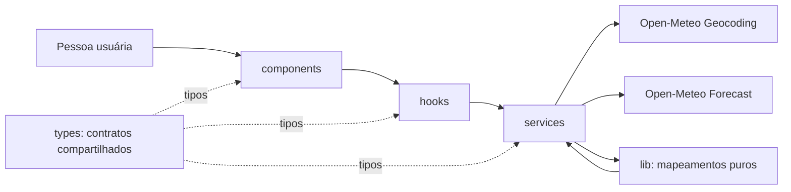

# Plano Técnico — Weather App

## Architecture

**Proposta:** SPA responsiva em React, coerente com a stack existente e com a exigência de uso móvel. A decisão final entre site responsivo, PWA ou app nativo continua condicionada à Open Question Q6 da spec; este plano não assume instalação offline ou capacidades nativas.



- **`components/` — apresentação:** renderiza dados recebidos por props e emite ações por callbacks. Não acessa rede, não conhece payloads Open-Meteo e não coordena efeitos.
- **`hooks/` — orquestração/estado:** coordena busca, seleção, carregamento de clima, retry, cancelamento/respostas obsoletas e unidade de exibição; chama serviços e fornece estado/ações à UI.
- **`services/` — acesso a dados:** contém `fetch`, URLs, parâmetros e tratamento de transporte/HTTP. Não importa React; delega mapeamento puro para `lib/` e retorna contratos internos.
- **`lib/` — funções puras:** conversão Celsius/Fahrenheit, mapeadores de payloads, validações e interpretação determinística de códigos meteorológicos. Não acessa rede, armazenamento nem estado React.
- **`types/` — contratos:** tipos como `City`, `CurrentWeather`, `ForecastDay`, `WeatherData` e `Unit`, compartilhados sem comportamento.
- **Provedor:** Open-Meteo para geocodificação e previsão, sem API key.
- **Persistência:** não há backend nem persistência de servidor na v1. Persistência no navegador permanece uma decisão aberta.

**Direção das dependências:** `components → hooks → services → APIs`; `services` pode usar funções puras de `lib/`, e todas as camadas podem importar contratos de `types/`. `lib/` não depende de React, rede ou estado. Isso mantém efeitos colaterais em poucos pontos e permite substituir cada dependência nos testes.

**Integração direta ou intermediada:** a spec ainda não decide se o navegador chama Open-Meteo diretamente. A proposta inicial é chamada direta à API pública para manter a arquitetura simples, condicionada à validação de termos, atribuição, CORS e limites de uso (Q12). Se um intermediário for necessário, revisar disponibilidade, privacidade e operação antes de alterar o escopo.

## Tech Stack

| Área | Tecnologia | Motivo/observação |
|---|---|---|
| Linguagem | TypeScript strict | Tipos compartilhados para API, estado e componentes. |
| UI e bundling | React 19 + Vite 8 | Já definidos no repositório; adequados à SPA proposta. |
| Estilo | Tailwind CSS 3 | Stack existente no projeto; o plano não define detalhes visuais. |
| Testes unitários/componentes | Vitest 4 + Testing Library | Compatíveis com os scripts e dependências atuais. |
| Testes de navegador | Playwright | Validar fluxos críticos e viewports móveis. |
| Lint/formatação | Biome 2 | Padrão existente no projeto. |
| Pacotes | pnpm 11 | Gerenciador declarado no `package.json`. |
| Dados meteorológicos | Open-Meteo Geocoding + Forecast | Decisão D1 da spec; sem chave de API. |

Não adicionar estado global ou cliente de cache dedicado sem necessidade demonstrada; o estado local do React e `fetch` são suficientes para o escopo atual.

## Project Structure

Estrutura proposta. `src/` e `tests/` ainda não existem neste workspace.

```text
src/
  components/
    CitySearch.tsx       # Campo de busca, resultados e estado vazio
    CurrentWeather.tsx   # Apresentação do clima atual
    Forecast.tsx         # Apresentação das cinco datas
    UnitSelector.tsx     # Controle Celsius/Fahrenheit
    WeatherStatus.tsx    # Loading, erro e retry
  hooks/
    useCitySearch.ts     # Estado e fluxo de geocodificação
    useWeather.ts        # Seleção de cidade, consulta e retry
  services/
    openMeteoService.ts  # Requests Geocoding/Forecast e erros HTTP
  lib/
    weatherMappers.ts    # Mapeia payloads externos para tipos internos
    temperature.ts      # Conversão pura entre Celsius e Fahrenheit
    weatherCodes.ts     # Código WMO para rótulo pt-BR
  types/
    weather.ts           # City, CurrentWeather, ForecastDay, WeatherData e Unit
  App.tsx                # Compõe hooks e componentes; não acessa a API
tests/
  lib/                   # Unit tests das funções puras em src/lib
  services/              # Requests e respostas simulados
  components/            # Renderização e interação via Testing Library
  hooks/                 # Estados e transições com serviços simulados
  e2e/                   # Fluxos completos no navegador
```

Manter um componente por arquivo conforme convenção do projeto. Os hooks são criados apenas para fluxos com estado/efeitos reutilizáveis; não criar camada de repositório, container de DI ou gerenciamento global sem necessidade concreta.

**Como a separação facilita os testes:** `lib/` recebe testes unitários determinísticos sem mocks; `services/` testa contrato HTTP com `fetch` simulado; `hooks/` testa loading/success/error/retry sem rede real; `components/` testa conteúdo e interação sem conhecer APIs. Playwright cobre somente os fluxos integrados mais importantes.

## Data Model

Contratos internos propostos, normalizados a partir dos campos disponíveis no Geocoding e Forecast da Open-Meteo. Os campos meteorológicos sugeridos ainda dependem da aprovação da Q1; os opcionais permitem representar respostas parciais. Temperaturas são mantidas internamente em Celsius; `Unit` representa somente a unidade de exibição.

```ts
type Unit = "celsius" | "fahrenheit";

interface City {
  id: number; // Identificador da localidade no Geocoding.
  name: string; // Nome da cidade retornado pela busca.
  latitude: number; // Latitude usada na consulta de previsão.
  longitude: number; // Longitude usada na consulta de previsão.
  country?: string; // País da localidade, quando disponível.
  countryCode?: string; // Código do país retornado pelo Geocoding.
  region?: string; // Divisão administrativa, como estado ou província.
  timeZone?: string; // Fuso horário da localidade, quando disponível.
}

interface CurrentWeather {
  observedAt?: string; // Horário da observação atual retornado pela API.
  temperatureC?: number | null; // Temperatura do ar em graus Celsius.
  apparentTemperatureC?: number | null; // Sensação térmica em graus Celsius.
  relativeHumidityPercent?: number | null; // Umidade relativa em porcentagem.
  weatherCode?: number | null; // Código WMO da condição meteorológica.
  precipitationMm?: number | null; // Precipitação atual em milímetros.
  cloudCoverPercent?: number | null; // Cobertura de nuvens em porcentagem.
  pressureMslHpa?: number | null; // Pressão ao nível do mar em hPa.
  windSpeedKmh?: number | null; // Velocidade do vento em km/h.
  windDirectionDegrees?: number | null; // Direção do vento em graus.
  isDay?: boolean | null; // Indica se a observação ocorreu durante o dia.
}

interface ForecastDay {
  localDate: string; // Data local ISO 8601; contrato candidato se Q2 confirmar previsão diária.
  weatherCode?: number | null; // Código WMO da condição prevista.
  temperatureMinC?: number | null; // Temperatura mínima em graus Celsius.
  temperatureMaxC?: number | null; // Temperatura máxima em graus Celsius.
  precipitationProbabilityMaxPercent?: number | null; // Probabilidade máxima de precipitação em porcentagem.
  precipitationSumMm?: number | null; // Precipitação total diária em milímetros.
  windSpeedMaxKmh?: number | null; // Velocidade máxima diária do vento em km/h.
  windDirectionDominantDegrees?: number | null; // Direção dominante diária do vento em graus.
}

interface WeatherData {
  city: City; // Localidade à qual os dados pertencem.
  current: CurrentWeather; // Observação meteorológica atual.
  forecast: ForecastDay[]; // Previsões diárias para a janela acordada.
  fetchedAt: string; // Instante UTC em que a aplicação recebeu a resposta.
}
```

- Coordenadas são necessárias para consultar forecast após a seleção da localidade.
- Campos opcionais ou `null` representam dados ausentes; a interface não deve inventar valores.
- `weatherCode` é o código WMO da API; a descrição pt-BR deve ser derivada por mapeamento.
- `observedAt` (`current.time` da API) é o horário da observação; `fetchedAt` é o recebimento da resposta pela aplicação. Não são equivalentes. A spec ainda precisa decidir qual deles satisfaz FR5.
- `timeZone` é opcional até validar o contrato do provedor e a decisão Q2; não calcular datas locais com fuso arbitrário.
- Os campos meteorológicos sugeridos devem ser confirmados na Q1 antes de se tornarem obrigatórios ou serem solicitados à API.
- `ForecastDay`, os arrays `daily.*` e o exemplo de cinco itens representam apenas a opção diária. Q2 ainda pode escolher previsão horária ou ambas; não derivar tarefas/testes que fixem granularidade antes dessa decisão. Se Q2 escolher granularidade horária ou mista, substituir/estender `ForecastDay` por um contrato de período que represente data e hora local.
- A janela contém hoje e os quatro dias seguintes; a granularidade e a política para `timeZone` ausente continuam condicionadas a Q2.
- FR5 não está fechado: Q4 precisa escolher entre horário de observação (`observedAt`) e recebimento (`fetchedAt`), além do frescor máximo. Não apresentar um deles como “última atualização” antes dessa decisão.
- Arredondamento e persistência da unidade dependem da Q5.

## Data Flow

```mermaid
flowchart LR
  Input[Input de busca] --> SearchHook[useCitySearch]
  Input -->|vazio| EmptyInput[Orientação: informar uma cidade]
  SearchHook -->|termo válido| GeoService[Service de geocoding]
  GeoService -->|resultados City[]| SearchHook
  GeoService -->|lista vazia| SearchHook
  GeoService -->|erro de rede ou API| SearchHook

  SearchHook -->|success| CityOptions[Resultados para seleção]
  SearchHook -->|empty| EmptyState[Estado vazio]
  SearchHook -->|error| ErrorState[Estado de erro]
  CityOptions --> CitySelection[Seleção de cidade]
  CitySelection --> AppState[App: cidade selecionada]
  AppState --> WeatherHook[useWeather]
  WeatherHook -->|solicita clima e previsão| ForecastService[Service de forecast]
  ForecastService -->|resposta válida ou parcial| WeatherHook
  ForecastService -->|erro ou timeout| WeatherHook
  WeatherHook -->|success| SuccessState[WeatherData]
  WeatherHook -->|success parcial| PartialState[Campos indisponíveis]
  WeatherHook -->|empty| EmptyState
  WeatherHook -->|error| ErrorState

  SuccessState --> UI[Componentes de UI]
  PartialState --> UI
  EmptyState --> UI
  ErrorState -->|retry de busca| SearchHook
  ErrorState -->|retry de previsão| WeatherHook
  EmptyInput --> UI
```

1. A pessoa usuária informa um termo de busca; a UI valida input vazio e apresenta estado de carregamento.
2. O serviço consulta Geocoding e mapeia os resultados para `City`; nenhum resultado produz estado vazio sem chamar Forecast.
3. A pessoa seleciona uma cidade; a aplicação mantém essa identidade e solicita clima atual e previsão.
4. O serviço valida a resposta externa e mapeia valores conhecidos para `WeatherData`, preservando ausências como indisponíveis.
5. A UI apresenta os dados, cinco datas locais e o timestamp definido como atualização. Os detalhes de campos, timezone e timestamp dependem de Q1, Q2 e Q4.
6. A mudança de Celsius/Fahrenheit converte todos os valores de temperatura já carregados sem nova consulta. Não converter outros tipos de medida até unidades serem decididas.
7. Se uma chamada falhar, a UI oferece nova tentativa e não apresenta dados anteriores como atuais.

Evitar que componentes consumam o formato bruto do provedor. Um único mapeador no serviço reduz o acoplamento do teste e da UI ao contrato externo.

## External APIs

### Geocoding — Open-Meteo

- **URL:** `https://geocoding-api.open-meteo.com/v1/search`.
- **Parâmetros:** `name` (consulta obrigatória), `count` (limite de resultados), `language=pt` e `format=json`.
- **Exemplo de requisição:** `https://geocoding-api.open-meteo.com/v1/search?name=Sao%20Paulo&count=10&language=pt&format=json`.
- **Resposta resumida:**

```json
{
  "results": [
    {
      "id": 3448439,
      "name": "São Paulo",
      "latitude": -23.5475,
      "longitude": -46.63611,
      "country": "Brasil",
      "country_code": "BR",
      "admin1": "São Paulo",
      "timezone": "America/Sao_Paulo"
    }
  ],
  "generationtime_ms": 0.2
}
```

- **Mapeamento para `City`:** `id` e `name` são copiados; `latitude` e `longitude` alimentam Forecast; `country` e `country_code` viram `country` e `countryCode`; `admin1` vira `region`; `timezone` vira `timeZone`. Campos geográficos que não vierem na resposta permanecem ausentes. Se `results` estiver ausente ou vazio, apresentar estado sem resultados e não chamar Forecast.
- O número de resultados, idioma e formatos de entrada seguem Q3. Validar nomes de campo e a disponibilidade de localização/região antes de congelar testes de contrato.

### Forecast — Open-Meteo

- **URL:** `https://api.open-meteo.com/v1/forecast`.
- **Parâmetros base:** `latitude` e `longitude` da `City`; `current` lista as variáveis atuais; `daily` lista as variáveis diárias; `timezone` determina os horários/dias retornados; `forecast_days=5` solicita a janela da spec.
- **Condicional de Q2:** `daily`, `ForecastDay` e a requisição ilustrada abaixo só são contrato de implementação se a spec aprovar granularidade diária. Se Q2 escolher horária ou diária+horária, decidir os parâmetros `hourly` e atualizar o modelo/mapeamento antes de decompor tarefas.
- **Condicional de Q1:** variáveis de clima/forecast nesta requisição são candidatas; solicitar apenas as aprovadas como campos de produto.
- **Unidades do contrato interno:** solicitar `temperature_unit=celsius`, `wind_speed_unit=kmh` e `precipitation_unit=mm`; converter temperatura para Fahrenheit somente na apresentação. Confirmar unidades de vento/precipitação com Q5.
- **Exemplo de requisição:**

```text
https://api.open-meteo.com/v1/forecast?latitude=-23.5475&longitude=-46.63611&current=temperature_2m,apparent_temperature,relative_humidity_2m,weather_code,precipitation,cloud_cover,pressure_msl,wind_speed_10m,wind_direction_10m,is_day&daily=weather_code,temperature_2m_min,temperature_2m_max,precipitation_probability_max,precipitation_sum,wind_speed_10m_max,wind_direction_10m_dominant&timezone=America%2FSao_Paulo&forecast_days=5&temperature_unit=celsius&wind_speed_unit=kmh&precipitation_unit=mm
```

- `timezone` deve receber `City.timeZone` quando válido. `timezone=auto` pode ser usado como alternativa do serviço quando as coordenadas forem fornecidas, mas o fallback de produto quando o fuso não for válido continua sujeito a Q2.
- **Resposta resumida:** `current` contém valores escalares; `daily` contém listas paralelas, indexadas por `time`.

```json
{
  "latitude": -23.55,
  "longitude": -46.63,
  "timezone": "America/Sao_Paulo",
  "current_units": {
    "time": "iso8601",
    "temperature_2m": "°C",
    "weather_code": "wmo code",
    "wind_speed_10m": "km/h"
  },
  "current": {
    "time": "2026-09-30T12:15",
    "temperature_2m": 22.4,
    "apparent_temperature": 23.1,
    "relative_humidity_2m": 58,
    "weather_code": 1,
    "precipitation": 0,
    "cloud_cover": 20,
    "pressure_msl": 1013.2,
    "wind_speed_10m": 12.6,
    "wind_direction_10m": 140,
    "is_day": 1
  },
  "daily_units": {
    "time": "iso8601",
    "temperature_2m_min": "°C",
    "temperature_2m_max": "°C",
    "precipitation_sum": "mm",
    "wind_speed_10m_max": "km/h"
  },
  "daily": {
    "time": ["2026-09-30", "2026-10-01"],
    "weather_code": [1, 3],
    "temperature_2m_min": [15.2, 16.1],
    "temperature_2m_max": [24.8, 25.3],
    "precipitation_probability_max": [10, 20],
    "precipitation_sum": [0, 0.4],
    "wind_speed_10m_max": [18.4, 20.1],
    "wind_direction_10m_dominant": [140, 155]
  }
}
```

- **Mapeamento de `current` para `CurrentWeather`:**

| Campo Open-Meteo | Campo interno | Regra |
|---|---|---|
| `time` | `observedAt` | Preservar timestamp; interpretar com `timezone` da resposta. |
| `temperature_2m` | `temperatureC` | Solicitar `temperature_unit=celsius`. |
| `apparent_temperature` | `apparentTemperatureC` | Solicitar em Celsius. |
| `relative_humidity_2m` | `relativeHumidityPercent` | Preservar porcentagem. |
| `weather_code` | `weatherCode` | Preservar código WMO; derivar texto pt-BR por mapeamento separado. |
| `precipitation` | `precipitationMm` | Solicitar `precipitation_unit=mm`. |
| `cloud_cover` | `cloudCoverPercent` | Preservar porcentagem. |
| `pressure_msl` | `pressureMslHpa` | Preservar hPa. |
| `wind_speed_10m` | `windSpeedKmh` | Solicitar `wind_speed_unit=kmh`. |
| `wind_direction_10m` | `windDirectionDegrees` | Preservar graus. |
| `is_day` | `isDay` | Converter `1` para `true` e `0` para `false`. |

- **Mapeamento de `daily` para `ForecastDay`:** para cada índice `i` de `daily.time`, criar um objeto e ler os demais arrays pelo mesmo índice.

| Campo Open-Meteo diário | Campo interno |
|---|---|
| `time[i]` | `localDate` |
| `weather_code[i]` | `weatherCode` |
| `temperature_2m_min[i]` | `temperatureMinC` |
| `temperature_2m_max[i]` | `temperatureMaxC` |
| `precipitation_probability_max[i]` | `precipitationProbabilityMaxPercent` |
| `precipitation_sum[i]` | `precipitationSumMm` |
| `wind_speed_10m_max[i]` | `windSpeedMaxKmh` |
| `wind_direction_10m_dominant[i]` | `windDirectionDominantDegrees` |

- `WeatherData.city` é a `City` selecionada; `WeatherData.current` é o mapeamento de `current`; `WeatherData.forecast` é a lista mapeada de `daily`; `WeatherData.fetchedAt` é registrado pelo cliente no recebimento.
- `WeatherData.fetchedAt` é criado no cliente quando a resposta chega. A Open-Meteo `current.time` é o horário da observação, não um timestamp genérico de atualização da fonte. Q4 é gate para decidir qual timestamp satisfaz FR5; não usar `fetchedAt` e `observedAt` como equivalentes.
- As listas `daily.*` devem ter tamanhos coerentes com `daily.time`; valores ausentes são mapeados para `null`/ausente, nunca para valores de outro índice. Campos e granularidade finais continuam condicionados a Q1/Q2. Os exemplos são resumidos, não payloads completos.
- Não realizar chamadas externas reais em testes unitários, de componente ou E2E; simular os contratos e adicionar teste de contrato separado se necessário.

## State Management

Manter estado local, sem store global. `App` mantém `selectedCity` e `temperatureUnit`, pois ambos são compartilhados pela apresentação atual. `useCitySearch` controla `searchQuery` e o ciclo de busca; `useWeather(selectedCity)` controla o ciclo de consulta meteorológica. Componentes recebem dados/status por props e emitem ações; não mantêm cópias dos dados remotos.

Estados explícitos por fluxo:

| Estado | Busca de cidade | Consulta meteorológica |
|---|---|---|
| `idle` | Nenhuma busca foi enviada ou o campo está vazio. | Nenhuma cidade selecionada. |
| `loading` | Geocoding está em andamento. | Clima atual e previsão estão sendo solicitados para a cidade selecionada. |
| `success` | Há um ou mais resultados de geocodificação. | Há dados meteorológicos utilizáveis; campos ausentes podem ser representados como indisponíveis. |
| `empty` | A busca foi concluída sem resultados. | A resposta válida não contém nenhum dado utilizável para a cidade. |
| `error` | A busca falhou por rede, timeout, HTTP ou resposta inválida. | A consulta falhou por rede, timeout, HTTP ou resposta inválida. |

Estado mínimo:

- `searchQuery`: termo atual; texto em branco após trim não inicia request.
- `searchState`: união discriminada com `status`; `success` contém `City[]`, `empty` não contém resultados e `error` contém erro normalizado.
- `selectedCity`: `City | null`; muda somente após seleção explícita de um resultado.
- `weatherState`: união discriminada com `status`; `success` contém `WeatherData`; resposta parcial permanece `success` com campos ausentes, não vira erro.
- `temperatureUnit`: `Unit`, inicia em `celsius`; persistência no navegador não está decidida.

Temperaturas de `WeatherData` permanecem normalizadas em Celsius. A UI deriva o valor exibido durante a renderização: Celsius retorna o valor armazenado; Fahrenheit calcula `(valorC * 9 / 5) + 32`. A função pura fica em `lib/temperature.ts`; não alterar o snapshot nem fazer novo request ao alternar unidade. Aplicar arredondamento/formatação somente conforme Q5, ainda pendente.

Ao selecionar outra cidade, limpar/invalidar imediatamente os dados anteriores e iniciar novo carregamento. Abortar a requisição anterior quando possível e sempre ignorar resposta obsoleta por identificador de request. Nenhum dado antigo deve ser apresentado como atual. Não introduzir persistência, cache ou estado global antes de decisão explícita.

## Error Handling

| Classe | Estado/ação | Comportamento esperado |
|---|---|---|
| Rede/offline | `error`, retryable | Encerrar loading, preservar termo/cidade, apresentar mensagem pt-BR e permitir nova tentativa manual. Não exibir cache como atual. |
| HTTP 4xx (exceto rate limit) | `error`, em geral não retryable sem correção | Normalizar a falha; não expor payload bruto do provedor. Orientar correção quando aplicável, sem retry automático. |
| HTTP 429 | `error`, retryable | Informar indisponibilidade temporária; respeitar `Retry-After` se fornecido e não repetir automaticamente em loop. |
| HTTP 5xx | `error`, retryable | Informar falha temporária do provedor e permitir retry manual; preservar cidade/consulta. |
| Timeout | `error`, retryable | Abortar request ao atingir o limite aprovado, encerrar loading e oferecer retry. O valor do limite aguarda Q8. Resposta tardia não pode sobrescrever request posterior. |
| JSON inválido ou estrutura essencial inválida | `error`, normalmente retryable | Tratar como resposta inválida, não renderizar payload parcialmente mapeado e registrar diagnóstico sem dados pessoais desnecessários. |
| Geocoding válido com zero resultados | `empty` | Preservar termo, informar que não houve correspondência e não solicitar Forecast. |
| Forecast válido sem campos utilizáveis | `empty` | Manter cidade selecionada e informar indisponibilidade de dados para essa localidade. |
| Resposta parcial com alguns campos válidos | `success` com valores opcionais ausentes | Renderizar campos disponíveis e marcar cada ausente como indisponível; não substituir por zero nem copiar valor de outro dia. |
| Timestamp ausente | Continua `success` se os dados meteorológicos forem utilizáveis | Aplicar AC5.2; não inventar horário. A semântica do timestamp e o frescor permanecem sujeitos a Q4. |
| Resposta de request obsoleto | Ignorada | Não alterar estado nem dados da cidade atualmente selecionada. |

Normalizar falhas para um erro interno (categoria, mensagem segura e possibilidade de retry); manter detalhes técnicos no serviço/log apropriado, sem exibir mensagem bruta da API. Mensagens finais e limite de timeout precisam de aprovação (Q8). Cache/stale-while-revalidate não faz parte da estratégia sem decisão explícita.

## Testing Strategy

- **Funções puras (Vitest):** testar `lib/temperature.ts` para Celsius inicial, conversões exatas nos dois sentidos e valores fracionários após aprovação de Q5; testar `weatherMappers.ts` para payloads válidos, campos ausentes, índices desalinhados, coordenadas e timezone; testar `weatherCodes.ts` para códigos conhecidos e desconhecidos. Testes específicos de agregação diária ficam condicionados a Q2. Esses testes não usam DOM, rede nem mocks.
- **Services (Vitest):** substituir `fetch` por mock e verificar URL, parâmetros (`current`, `daily`, unidades e `timezone`), mapeamento e tratamento de respostas. Cobrir sucesso, lista vazia, HTTP 4xx/429/5xx, falha de rede, timeout, JSON inválido e resposta parcial. Verificar que geocoding vazio não chama Forecast e que a mensagem não expõe payload bruto.
- **Hooks (Vitest + Testing Library):** testar transições `idle → loading → success/empty/error`, retry, mudança de cidade durante uma requisição e descarte de resposta obsoleta; usar services simulados para não depender de rede real.
- **Componentes (Vitest + Testing Library):** testar apresentação nos estados `loading`, `error`, `empty` e `success`; seleção de cidade, campos indisponíveis, alternância de unidade e ação de retry. Usar roles/labels e `userEvent` para verificar acessibilidade e interação por teclado, sem testar detalhes internos de implementação.
- **E2E (Playwright):** cobrir busca → seleção → clima atual/previsão → alternância C/F; geocoding sem resultados sem chamada Forecast; falha seguida de retry com sucesso. Interceptar APIs para resultados determinísticos e validar mensagens/estados visíveis.
- **Viewport mobile (Playwright):** executar os fluxos principais na largura mínima de 320 px proposta em NFR1, além de um viewport desktop. Verificar ausência de rolagem horizontal e que busca, resultados, temperaturas e retry permanecem visíveis/utilizáveis. Ampliar a matriz quando Q6 for decidida.
- **NFRs e rastreabilidade:** associar testes aos IDs `ACx.y` e à matriz `Traceability`. Medições de desempenho, disponibilidade e conformidade WCAG só viram gates após protocolo/metas aprovados (Q7); não simular esses resultados com testes funcionais.
- **Isolamento externo:** testes unitários, de componente e E2E não dependem da disponibilidade da Open-Meteo. Testes de contrato/smoke contra o serviço real são uma camada separada, não executada como parte da suíte determinística padrão.

## Risks & Trade-offs

| Decisão | Alternativa considerada | Trade-off e justificativa |
|---|---|---|
| Estado local em `App`/hooks | Store global (Redux/Zustand) | Estado local reduz dependências e cerimônia para uma tela/fluxo. Store global seria útil com múltiplas áreas, cache compartilhado ou sincronização; reconsiderar se o escopo crescer. |
| Open-Meteo chamada diretamente pelo service no cliente | Backend/proxy intermediário | Chamada direta evita infraestrutura e gestão de chave, mas herda disponibilidade, limites, CORS e exposição das consultas ao provedor. Validar Q12; usar intermediário apenas se houver requisito de segurança, cache, quota ou operação que o justifique. |
| Normalizar resposta externa para tipos internos | Passar payload Open-Meteo diretamente aos componentes | Mapeamento isolado desacopla UI/testes de nomes e formato do fornecedor; tem custo pequeno de código e precisa de testes de contrato/mapeamento. |
| Guardas de tipo próprias no service | Biblioteca de validação de schema (ex.: Zod) | Guardas evitam nova dependência para poucos endpoints; biblioteca melhora validação declarativa e diagnósticos, mas adiciona pacote e abstração. Reavaliar se o contrato crescer ou ficar mais variável. |
| Derivar Fahrenheit durante renderização | Solicitar dados em Fahrenheit ou armazenar duas cópias | Dados canônicos em Celsius evitam novo request e divergência entre unidades; conversão custa CPU insignificante. Unidades de vento/precipitação não são convertidas até Q5. |
| Sem cache persistente na v1 | Cache local/offline ou biblioteca de cache | Não armazenar evita exibir dados obsoletos e reduz política de retenção; perde suporte offline e pode repetir requests. Só adicionar após decisão Q10 e regra de frescor. |
| E2E com APIs interceptadas | E2E dependente da Open-Meteo real | Interceptação torna testes repetíveis e independentes de quota/rede; não detecta mudanças reais do provedor. Cobrir esse risco com verificação de contrato/smoke separada e controlada. |
| SPA responsiva como proposta | PWA ou app nativo | SPA se alinha a Vite e atende o requisito móvel com menor custo; PWA/nativo trazem instalação/capacidades extras, ainda não exigidas. Confirmar Q6 antes de tarefas de distribuição. |
| Contrato e metas ainda pendentes | Fixar defaults no plano | Não inventar decisões evita implementar o comportamento errado, mas bloqueia critérios completos. Resolver Q1–Q9 e Q12 ou registrar aceite formal antes da baseline de produção. |

**Decisões de entrada para o backlog:** D1–D5 da spec são assumidas como fechadas. Q1/Q2/Q4/Q5 condicionam contratos e testes de dados/unidades; Q6 define distribuição e matriz de suporte; Q7 define os gates NFR; Q12 condiciona a integração com o provedor. Q1–Q9 e Q12 devem ser respondidas ou formalmente aceitas como restrições antes da baseline de aceite/produção. Q10 define escopo do MVP; Q11 orienta métricas de produto. Não decompor comportamento dependente como requisito fechado antes dessas decisões.